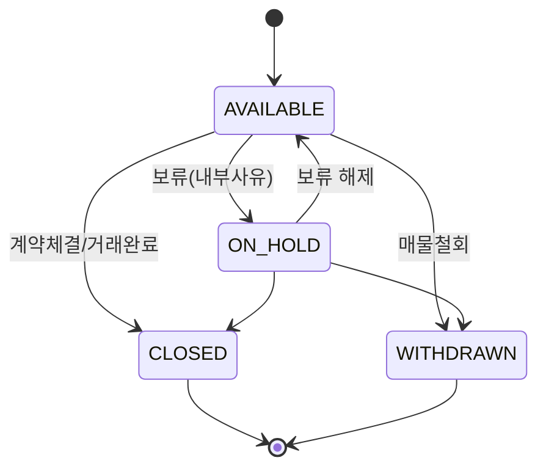

Airtable 스타일 분석 로그

이 문서는 에어테이블 관련 UI/UX 분석 결과를 날짜별로 누적 기록합니다. 새로운 결과는 문서 맨 아래에 항목을 추가합니다.

## 2025-08-17 — 에어테이블 리스트 형태

### 핵심 요약

- **레이아웃**: 단일 컬럼 카드형이 아닌 “테이블에 가까운 리스트”. 행(Row)은 얇고 밀도 높게, 컬럼은 최소 보더/세퍼레이터로 구분.
- **밀도/간격**: 작은 폰트(12–14px), 행 높이 36–44px, 수평 패딩 8–12px. 정보 밀도 우선.
- **구분선/배경**: 아주 연한 그레이 보더(#EDEDED 전후), 호버 시 행 배경 살짝 톤업, 선택 시 연한 하이라이트.
- **타이포/아이콘**: 본문은 중립 폰트(Inter류), 굵기는 400–500 중심. 상태/필드 타입은 작은 아이콘+색상 뱃지.
- **셀 타입 표현**:
  - 텍스트/숫자: 한 줄 절삭(ellipsize), 우측 정렬은 숫자/금액.
  - 선택형: 라운드 필(Pill) 컬러 뱃지.
  - 날짜: 간결 포맷(YYYY‑MM‑DD), 오늘/가까운 날짜는 미묘한 컬러 강조.
  - 링크/레퍼런스: 칩 또는 콤팩트한 아바타+텍스트.
  - 사람/협업: 작은 아바타 스택.
  - 체크박스/상태: 소형 토글/체크.
- **인라인 편집**: 클릭 시 해당 셀이 가볍게 에디터로 전환(셀 타입별 에디터).
- **행 상호작용**: 호버 시 좌측 체크박스와 우측 퀵 액션(…/편집/열기) 노출. Shift/⌘ 멀티 셀렉션.
- **헤더/툴바**: 상단 View 바 + 필터/정렬/그룹/행높이/컬럼 표시 설정. 컬럼 헤더는 정렬 토글, 리사이즈 핸들.
- **스크롤/가상화**: 대용량에서 무한 스크롤 또는 가상 리스트.
- **상태 화면**: Empty(가이드+CTA), 로딩(스켈레톤), 에러(간결 메시지+재시도).
- **접근성**: 키보드 내비게이션(↑↓, Enter, Esc), 포커스 링 뚜렷, 체크박스/버튼은 ARIA 라벨.

### Tailwind 기준 구현 팁

- **행 스타일**: `grid grid-cols-[...] items-center h-10 px-3 hover:bg-gray-50 aria-selected:bg-indigo-50`
- **보더**: 컨테이너 `divide-y divide-gray-100`, 헤더 `border-b`
- **텍스트**: 기본 `text-sm text-gray-800`, 보조 `text-xs text-gray-500`
- **뱃지**: `inline-flex items-center rounded-full px-2 py-0.5 text-xs font-medium bg-emerald-50 text-emerald-700`
- **셀 절삭**: `truncate` + `title` 속성
- **숫자 정렬**: `text-right tabular-nums`
- **헤더 버튼**: `text-gray-500 hover:text-gray-900` + 정렬 아이콘 토글

### 간단 예시 (React + Tailwind)

```tsx
type Column = { key: string; title: string; align?: 'left' | 'right' | 'center'; width?: string };
type Row = Record<string, unknown>;

function ListHeader({ columns }: { columns: Column[] }) {
  return (
    <div className="grid w-full border-b border-gray-200 bg-white text-xs font-medium text-gray-500"
         style={{ gridTemplateColumns: columns.map(c => c.width ?? '1fr').join(' ') }}>
      {columns.map(col => (
        <button key={col.key}
          className="h-9 px-3 flex items-center gap-1 hover:text-gray-900">
          <span className="truncate">{col.title}</span>
          <svg className="h-3 w-3 text-gray-400" viewBox="0 0 20 20" aria-hidden="true"><path d="M6 8l4 4 4-4" fill="currentColor"/></svg>
        </button>
      ))}
    </div>
  );
}

function ListRow({ row, columns, selected }: { row: Row; columns: Column[]; selected?: boolean }) {
  return (
    <div
      className="grid items-center h-10 px-3 hover:bg-gray-50 aria-selected:bg-indigo-50"
      aria-selected={selected}
      style={{ gridTemplateColumns: columns.map(c => c.width ?? '1fr').join(' ') }}
    >
      {columns.map(col => (
        <div key={col.key}
             className={`truncate text-sm text-gray-800 ${col.align === 'right' ? 'text-right tabular-nums' : col.align === 'center' ? 'text-center' : ''}`}
             title={String(row[col.key] ?? '')}>
          {String(row[col.key] ?? '')}
        </div>
      ))}
    </div>
  );
}

export function AirtableLikeList({ columns, data }: { columns: Column[]; data: Row[] }) {
  return (
    <div className="w-full rounded-lg border border-gray-200 bg-white overflow-hidden">
      <ListHeader columns={columns} />
      <div className="divide-y divide-gray-100">
        {data.map((row, i) => (
          <ListRow key={i} row={row} columns={columns} />
        ))}
      </div>
    </div>
  );
}
```

### 구현 체크리스트

- **정렬/필터/그룹**: 헤더/툴바에서 제어, URL 동기화
- **열 너비/순서 저장**: 로컬스토리지 또는 서버에 퍼시스트
- **인라인 편집**: 셀 포커스-에디터 전환, 타입별 컴포넌트
- **가상 스크롤**: 1만+ 건 대비 `react-virtualized`/`react-virtuoso`
- **접근성/키보드**: 포커스 이동, 멀티셀렉트, 스크린리더 라벨

---

## 2025-08-17 — Interface UX/UI 분석 (이미지 기반)

본 문서는 제공된 두 장의 화면 캡처만을 근거로 한 UI 구조 및 UX 흐름 분석입니다. 실제 코드/데이터는 참조하지 않았습니다.

## 개요
- **목적**: 부동산 매물 업무 화면의 정보 구조, 상호작용, 접근성, 개선 포인트 도출
- **패턴**: 좌측 목록(마스터) + 우측 상세(디테일)의 마스터-디테일 레이아웃
- **핵심 가치**: 높은 정보 밀도, 빠른 조회-판단-기록 사이클 지원

## 레이아웃 구조
- **상단**: 페이지 경로/제목, 필터/정렬/검색 컨트롤
- **좌측(≈65~70%)**: 테이블 목록
- **우측(≈30~35%)**: 선택 행의 상세 패널(스크롤)

## 탐색/컨트롤
- **필터**: `매물종류`, `거래유형`, `매물상태` 드롭다운 3종
- **정렬**: 컬럼 헤더(예: 등록일) 화살표로 정렬 상태 표기, 우상단 `Sort` 버튼 존재
- **검색**: 돋보기 아이콘 기반 검색 진입
- **상태 피드백**: 행 선택 즉시 우측 상세 동기화

## 테이블 설계
- **주요 컬럼**: 등록일, 공유여부, 담당자, 매물상태, 매물종류, 거래유형, 금액, 매물명, 동, 호, 공급/전용(㎡·평), 해당층/총층
- **상호작용성**: 상태/종류/유형 칩 스타일(파란색) → 필터/상태 변경 액션 암시
- **가독성**: 숫자 단위 표기(억/만원, ㎡/평 동시), 선택/호버 시 배경차이
- **정렬 기본값**: 등록일 내림차순 추정

## 상세 패널 설계
- **헤더**: 매물명, 외부 링크 아이콘, 닫기 버튼
- **정보 그룹**: 
  - 기본: 공유여부, 담당자, 매물상태, 재등록사유
  - 매물: 매물종류, 매물명, 동/호
  - 위치: 소재지
  - 거래: 거래유형, 계약기간, 임차금액, 임차유형
  - 기타: 광고상태, 공동연락처/중개, 영상/사진, 거주자, 거래완료일
  - 메모: 담당자MEMO, 특이사항(멀티라인)
- **상태 컬러**: 완료/가능 등 상태를 칩/색으로 명확히 구분(파란/녹색)

## 사용자 플로우(업무 시나리오)
1) 필터/정렬 설정 → 2) 목록 스캔/행 선택 → 3) 상세 확인 → 4) 상태 변경/메모 기록 → 5) 다음 행 이동

## 접근성/키보드
- **탭 순서**: 필터 컨트롤 → 액션 버튼 → 테이블 → 상세 패널
- **단축키 제안**: 화살표로 행 이동, Enter로 상세 초점/액션, Space로 체크 토글
- **ARIA 라벨 제안**: 테이블/필터/버튼/칩에 역할 및 상태 라벨 부여

## 반응형 가이드(제안)
- ≥1440px: 좌 70% / 우 30%
- 1200~1439px: 좌 65% / 우 35%
- 1024~1199px: 좌 60% / 우 40%
- <1024px: 상세 패널을 오버레이/드로어로 전환

## 디자인 토큰(추정)
- **색상**:
  - 액션/링크: 파란색(예: #1663D6 계열)
  - 성공/완료/렌트 강조: 녹색(예: #16A34A 계열)
  - 텍스트 기본: #111827~#374151, 보조: #6B7280
  - 구분선/채움: #E5E7EB, 배경: #F9FAFB
- **타이포**: 제목 18~20px, 헤더 14~16px, 본문 13~14px, 동일 패밀리 사용

## 강점
- 한 화면에서 다량의 매물 비교/판단 가능(정보 밀도↑)
- 선택 즉시 상세 연동(맥락 전환 비용↓)
- 상태 정보 시각화(칩/색상)로 스캔 속도↑

## 개선 포인트(우선순위 제안)
1. **컬럼 가독성**: 금액/면적 포맷 표준화, 단위 라벨 고정, 긴 텍스트 말줄임 처리 통일
2. **상세 패널 정보 그룹핑**: 라벨-값 정렬과 섹션 헤더 대비 강화, 빈 값은 `-` 또는 회색 플레이스홀더 일관화
3. **칩의 역할 일관성**: 클릭 시 동작(필터 적용 vs 상태 변경) 분리/명시, 호버 툴팁 제공
4. **키보드 내비**: 행 이동/선택/상세 초점 이동의 일관 규칙 제공
5. **성능**: 목록 가상 스크롤 또는 페이지네이션, 상세 프리페치, 메모 자동 저장
6. **오류/오프라인**: 네트워크 에러 복구 흐름, 오프라인 편집 큐

## 컴포넌트 인벤토리(요약)
- 필터바: `Select(3)`, `Button(Filter)`, `Button(Sort)`, `Icon(Search)`
- 테이블: `Table`, `TableHeader`, `TableRow`, `TableCell`, `StatusChip`
- 상세: `Drawer/SidePanel`, `Section`, `DefinitionList(라벨:값)`, `Tag/Chip`, `Textarea`

## QA 체크리스트(발췌)
- 컬럼 정렬/필터/검색 동시 사용 시 일관성 유지 여부
- 행 선택 상태가 스크롤 후에도 유지되는지
- 빈 데이터의 시각 처리 일관성
- 반응형에서 상세 패널 접근 가능성(포커스 트랩, 스크롤)

## 향후 확장 아이디어
- 저장된 뷰/필터 프리셋, 고급 필터(면적/가격 범위)
- 상세 패널 인라인 편집, 변경 이력
- 사용자별 컬럼 보이기/순서 커스터마이즈

본 분석은 이미지 기반 가설이며, 실제 사용자 행동 데이터(클릭맵, 체류시간, 전환 등)와 결합하여 우선순위를 재정렬하는 것을 권장합니다.


## 세부 구성 사양(Information Architecture)

### IA 트리
- 페이지
  - 상단 바
    - 경로/제목
    - 컨트롤 그룹: `매물종류 Select`, `거래유형 Select`, `매물상태 Select`, `Filter Button`, `Sort Button`, `Search Icon`
  - 본문
    - 좌측: 매물 테이블
    - 우측: 상세 패널(선택 매물)

### 데이터 사전 – 테이블 컬럼
| 키 | 라벨 | 타입 | 포맷/validation | 예시 |
|---|---|---|---|---|
| created_at | 등록일 | Date | YYYY-MM-DD, 정렬 가능 | 2025-08-15 |
| shared | 공유여부 | Boolean | 체크/언체크 | true |
| owner | 담당자 | String | 2~10자 | 박소현 |
| status | 매물상태 | Enum | 거래가능/거래완료/철회... | 거래완료 |
| category | 매물종류 | Enum | 아파트/빌라/단독주택/오피스텔... | 아파트 |
| deal_type | 거래유형 | Enum | 렌트/전세/매매/월세... | 렌트 |
| price | 금액 | Numeric/String | 매매: 억/만원, 전월세: 보증/월 | 2억/1,000 |
| title | 매물명 | String | 최대 40자, 말줄임 | 롯데캐슬이스트폴 |
| dong | 동 | String/Number | 1~4자리 | 102 |
| ho | 호 | String/Number | 1~5자리 | 4704 |
| area_m | 공급/전용(㎡) | String | 공급/전용 함께 표기 | 180.16/138.52 |
| area_p | 공급/전용(평) | String | 공급/전용 함께 표기 | 54.49/41.9 |
| floor | 해당층/총층 | String | n층/m층 | 47/48층 |

### 데이터 사전 – 상세 패널
| 그룹 | 라벨 | 키 | 타입 | 비고 |
|---|---|---|---|---|
| 기본 | 공유여부 | shared | Boolean | 체크형 표시 |
| 기본 | 담당자 | owner | String | 칩/라벨 |
| 기본 | 매물상태 | status | Enum | 칩, 상태 변경 트리거 가능 |
| 기본 | 재등록사유 | re_register_reason | String | 선택/자유입력 |
| 매물 | 매물종류 | category | Enum | 칩 |
| 매물 | 매물명 | title | String | 제목과 동기화 |
| 매물 | 동/호 | dong/ho | String | - |
| 위치 | 소재지 | address | String | 도로명/지번 허용 |
| 거래 | 거래유형 | deal_type | Enum | 녹색 강조(렌트) |
| 거래 | 계약기간 | contract_period | DateRange | YY.MM~YY.MM |
| 거래 | 임차금액 | rent_price | String | 보증/월, 0 허용 |
| 거래 | 임차유형 | rent_type | Enum | 1년/2년/장기 등 |
| 기타 | 광고상태 | ad_status | Enum | - |
| 기타 | 공동연락처 | co_phone | String | 다수 가능 |
| 기타 | 공동중개 | co_broker | String | - |
| 기타 | 영상/사진 | media | Array | 개수/미리보기 |
| 기타 | 거주자 | resident | Enum | 임차인/공실 등 |
| 기타 | 거래완료날짜 | closed_at | Date | YYYY.MM.DD |
| 메모 | 담당자MEMO | memo | Text | 자동 저장 권장 |
| 메모 | 특이사항 | note | Text | 다중라인 |

## 상호작용 플로우 상세
- 필터 적용
  1) Select 변경 → 2) `Filter` 클릭 → 3) 로딩(스켈레톤) → 4) 결과/선택 유지
- 정렬 변경
  1) 헤더 클릭 → 2) 화살표 방향 전환 → 3) 스크롤 위치 유지
- 검색
  1) 아이콘 클릭 → 2) 입력(디바운스 300ms) → 3) 결과 하이라이트
- 행 선택
  1) 클릭/키보드 이동 → 2) 선택 스타일 → 3) 우측 상세 페치/프리페치 반영
- 상태/칩 액션
  1) 칩 클릭 → 2) 모달/패널 열림 → 3) 저장 시 토스트 + 목록/상세 동기 갱신

## 상태 및 오류 화면
- 로딩: 테이블/상세 스켈레톤, 필터 버튼 로딩 스피너
- 빈 상태: 조건 일치 없음 카드 + 필터 초기화 CTA
- 에러: 네트워크/권한/유효성 에러별 메시지 + 재시도
- 오프라인: 읽기 전용 안내, 큐 대기 후 재전송

## 접근성 세부
- 키보드: ArrowUp/Down 행 이동, Enter 선택, Tab 상세로 포커스 이동
- ARIA: `table[aria-label="매물 목록"]`, 칩 `role=button` + `aria-pressed`/`aria-label`
- 포커스 인디케이터: WCAG 가이드 준수(2px 대비선)

## 반응형/레이아웃 디테일
- 컬럼 최소/최대 폭 가드, 긴 값은 `...` 말줄임 + 툴팁
- <1024px: 상세를 풀스크린 드로어로 전환, 뒤로가기로 닫힘

## 성능/데이터 전략
- 목록: 가상 스크롤 또는 페이지네이션(페이지 50, 프리페치 ±1페이지)
- 요청: 필터/검색 디바운스 300ms, 중복 요청 취소(AbortController)
- 캐싱: 쿼리 키 = 필터/정렬/페이지, 상세 5분 소프트 캐시
- 이미지: 썸네일 lazy-load, LQIP/blur-up

## 측정 지표(KPI)
- 목록 → 상세 전환 시간 p95 < 300ms
- 필터 적용 후 최초 페인트 < 500ms
- 오류율 < 0.5%, 오프라인 성공 재전송율 > 98%
- 사용성: 행 선택 후 다음 행 이동까지 평균 2초 이하

## 테스트 시나리오(E2E)
- 필터/정렬/검색을 조합한 상태에서 행 선택 시 상세가 정확히 일치
- 뒤로가기 사용 시 최근 필터/선택 상태 복원(URL 동기화)
- 빈 데이터/에러 상태에서 CTA 동작 검증

## 디자인 토큰(확장)
- Radius: 6/8px, Border: 1px #E5E7EB
- Spacing Scale: 4/8/12/16/20/24px
- Elevation: 상세 패널 shadow-md(모달은 lg)
- 모션: 진입/퇴장 150~200ms ease-out, 스켈레톤 1.2s pulse

## 오픈 이슈/결정 필요
- 칩 클릭의 기본 동작(필터 vs 상태 변경) 일관 정책
- 금액 포맷 표준(매매/전월세 케이스)
- 상세 패널 내 인라인 편집 허용 범위와 권한

## 로드맵 제안
- 사용자별 컬럼 구성/고정/순서 커스터마이즈
- 고급 필터(가격/면적 범위, 다중 조건 저장 프리셋)
- 상세 이력/활동 로그, 변경 감사 추적


## 상세 레이아웃 구조 분석 – 상세 정보 컨테이너

아래 트리는 제공된 화면을 바탕으로 상세 패널의 시각/상호작용 스펙을 구조적으로 정리한 것입니다.

```
상세 정보 컨테이너
├── 패널 헤더
│   ├── 매물명: "롯데캐슬이스트폴"
│   │   ├── 폰트 크기: 18-20px
│   │   ├── 폰트 굵기: Bold
│   │   └── 색상: 진한 회색
│   ├── 링크 아이콘: 외부 링크 표시
│   │   ├── 크기: 20px x 20px
│   │   ├── 색상: 파란색
│   │   └── 위치: 우측 상단
│   └── 닫기 버튼 (x)
│       ├── 크기: 24px x 24px
│       ├── 색상: 회색
│       └── 위치: 우측 상단
├── 정보 필드 그룹
│   ├── 기본 정보
│   │   ├── 공유여부: 빈 값
│   │   ├── 담당자: "박소현"
│   │   ├── 매물상태: "거래완료" (파란색 링크)
│   │   └── 재등록사유: "렌트로 계약"
│   ├── 매물 정보
│   │   ├── 매물종류: "아파트" (파란색 링크)
│   │   ├── 매물명: "롯데캐슬이스트폴"
│   │   ├── 동: "102"
│   │   └── 호: "4704"
│   ├── 위치 정보
│   │   └── 소재지: "자양동 680-63"
│   ├── 거래 정보
│   │   ├── 거래유형: "렌트" (녹색 텍스트)
│   │   ├── 계약기간: "25.08~26.08"
│   │   ├── 임차금액: "0/1050"
│   │   └── 임차유형: "1년렌트"
│   ├── 상태 정보
│   │   ├── 광고상태: 빈 값
│   │   ├── 공동연락처: 빈 값
│   │   ├── 공동중개: 빈 값
│   │   ├── 영상: 빈 값
│   │   ├── 사진: 빈 값
│   │   ├── 거주자: "임차인"
│   │   └── 거래완료날짜: "25.08.16"
│   └── 메모 정보
│       ├── 담당자MEMO: 다중 라인 텍스트
│       └── 특이사항: 다중 라인 텍스트
└── 스크롤 영역
    ├── 세로 스크롤: 내용이 많을 때
    ├── 스크롤바 스타일: 세련된 디자인
    └── 부드러운 스크롤 효과
```

보조 사양(레이아웃/간격):
- 컨테이너 패딩: 16~24px, 섹션 간 `gap 16px`
- 라벨:값 정렬은 2열 그리드 권장(`min-content 120~140px` : `1fr`)
- 라벨 타이포 13~14px/Medium, 값 13~14px/Regular, 줄간격 1.4~1.6
- 긴 텍스트(메모/특이사항)는 3~6행 기본 높이, 컨텐츠에 따라 자동 확장
- 비어있는 값은 `-` 또는 흐린 회색(placeholder)로 일관 표기

## 상단 헤더 구조 및 컨트롤 사양

- 좌측: 페이지 제목 `더부동산 임시매물장`
- 우측: `Filter` 텍스트 버튼, `Sort` 텍스트 + 카운트 배지(예: 1), `Search input(placeholder: "Search records")`
- 정렬/검색 영역은 테이블 상단 우측에 고정 배치, 입력 시 테이블 즉시 반영(디바운스)
- 필터 그룹: 좌측 상단에 `매물종류`, `거래유형`, `매물상태` 3개 드롭다운 나란히 배치
  - 각 컨트롤 좌우 여백 8~12px, 높이 36~40px, 테두리 `#E5E7EB`, radius 8px
  - 포커스 시 파란색 outline(접근성 기준 준수)

## 필터 드롭다운 사양(이미지 기반)

- 헤더: `Find an option`(검색 입력 포함 가능)
- 옵션 아이템: `체크박스` + `컬러칩` + `라벨`
- 스크롤 지원, 멀티셀렉트 지원, 선택 시 드롭다운 상단에 고정 정렬(옵션)
- 예시 옵션 및 칩 색
  - 거래유형: 매매(파랑), 월세(하늘), 전세(민트), 렌트(연녹), 단기(연노랑)
  - 매물상태: 매물철회(회색/파랑), 거래완료(하늘), 거래가능(민트), 거래보류(연녹)
- 동작
  1) 체크/해제 → 내부 상태 업데이트
  2) 닫힘 시 `Filter` 상태 업데이트 및 테이블 재조회
  3) 선택 수가 많을 경우 카운트 배지로 축약 표기

## 테이블 헤더 구조(열 정의/정렬/정렬 가능 여부)

| 열 | 정렬 | 정렬기본 | 정렬가능 | 정렬키 제안 |
|---|---:|---:|:---:|---|
| 등록일 | 좌 | ↓ | ✓ | created_at |
| 공유여부 | 가운데 |  |  | shared |
| 담당자 | 좌 |  | ✓ | owner |
| 매물상태 | 가운데 |  |  | status |
| 매물종류 | 가운데 |  |  | category |
| 거래유형 | 가운데 |  |  | deal_type |
| 금액 | 우 |  | ✓ | price_sort |
| 매물명 | 좌 |  |  | title |
| 동 | 가운데 |  |  | dong |
| 호 | 가운데 |  |  | ho |
| 공급/전용(㎡) | 우 |  | ✓ | area_supply_net_m |
| 공급/전용(평) | 우 |  |  | area_supply_net_p |
| 해당층/총층 | 가운데 |  | ✓ | floor_current_total |

폭 가이드: 숫자열 우측 정렬, 텍스트 좌측 정렬, 상태/종류/유형은 칩 중앙 정렬.

## 이미지에서 확인된 기능 총정리

- 멀티 필터 드롭다운(색상 칩, 체크박스)
- 정렬 상태 시각화(헤더 화살표, Sort 카운트 배지)
- 상단 우측 글로벌 검색(placeholder, clear 아이콘)
- 목록-상세 연동(행 클릭 → 우측 패널 갱신)
- 상태/유형 칩 클릭 시 액션(필터 적용 또는 변경 진입)
- 스켈레톤/로딩 인디케이터(우하단 스피너 확인)
- 공유여부 시각화(초록 체크/회색 원)
- 상세 패널 내 `X/O/-` 표기(영상/사진 유무 표현)

## UI ↔ 데이터 매핑 구조(권장 스키마)

| UI 요소 | 파라미터 키 | DB 컬럼(예시) | 값/타입 |
|---|---|---|---|
| 매물종류 Select | propertyType[] | properties.category | Enum[] |
| 거래유형 Select | dealType[] | deals.type | Enum[] |
| 매물상태 Select | status[] | properties.status | Enum[] |
| 검색 입력 | q | properties.title, address, memo | string |
| Sort(등록일) | sort=created_at,dir=desc | properties.created_at | asc/desc |
| Sort(금액) | sort=price,dir=asc | deals.price_sort | asc/desc |
| 행 선택 | id | properties.id | UUID |

### URL/요청 파라미터 매핑 예시

```text
/inventory?propertyType=apartment,villa&dealType=rent,jeonse&status=available&sort=created_at&dir=desc&q=레미안&page=1&pageSize=50
```

### Enum 코드 매핑(예시)

```json
{
  "propertyType": {"APT": "apartment", "VILLA": "villa", "HOUSE": "detached", "OFFICETEL": "officetel"},
  "dealType": {"SALE": "sale", "MONTHLY": "wolse", "JEONSE": "jeonse", "RENT": "rent", "SHORT": "short"},
  "status": {"DONE": "closed", "AVAILABLE": "available", "WITHDRAWN": "withdrawn", "ON_HOLD": "on_hold"}
}
```

## 색상/칩 매핑(제안)

| 도메인 | 값 | 색상 토큰 |
|---|---|---|
| 거래유형 | 매매 | Blue 500 |
| 거래유형 | 월세 | Sky 300 |
| 거래유형 | 전세 | Teal 300 |
| 거래유형 | 렌트 | Green 300 |
| 거래유형 | 단기 | Amber 300 |
| 매물상태 | 거래완료 | Sky 300 |
| 매물상태 | 거래가능 | Teal 300 |
| 매물상태 | 매물철회 | Slate 400 |
| 매물상태 | 거래보류 | Green 300 |

## 헤더/검색 UX 세부

- 검색은 전체 테이블 텍스트 대상(제목/주소/담당자/메모), 키워드 하이라이트 옵션
- 입력 300ms 후 질의, ESC로 클리어, 엔터로 첫 결과 포커스 이동
- Sort 카운트는 현재 활성화된 정렬 기준 수 표시(복합 정렬 미사용 시 1)

## 권한/감사 추적(옵션)

- 상세 편집 시 사용자/시간/필드 변경 이력 저장
- 상태 변경은 코멘트 요구 옵션, 우측 하단 토스트로 결과 알림

## 디자인 디테일 사양(Visual/Interaction Specs)

### 타이포그래피 스케일
- Display: 24px / 700 / 1.25
- Title: 20px / 700 / 1.3
- Section: 16px / 600 / 1.4
- Body: 14px / 400 / 1.6
- Caption: 12px / 400 / 1.4
- 숫자열: 14px / 500 / 1.4, 탭/정렬 헤더는 600 권장

### 컬러 팔레트(제안 HEX)
- Primary: #1663D6, Primary-600: #1452AE, Primary-50: #E7F0FF
- Success: #16A34A, Success-50: #ECFDF5
- Info: #38BDF8, Info-50: #E0F2FE
- Warning: #F59E0B, Warning-50: #FFFBEB
- Danger: #EF4444, Danger-50: #FEF2F2
- Neutral: 900 #111827, 700 #374151, 500 #6B7280, 300 #D1D5DB, 200 #E5E7EB, 50 #F9FAFB

### 간격/그리드
- Spacing scale: 4/8/12/16/20/24/32px
- 컨텐츠 좌우 패딩: 데스크톱 24px, 협대 화면 16px
- 테이블 행 높이: Comfortable 44px, Compact 36px
- 상세 패널 내부 섹션 간격: 16px, 라벨-값 수평 간격 12px
- 12-column fluid grid, gutter 24px, breakpoints: 640/768/1024/1280/1536

### 테이블 스타일
- 헤더: 12px/600/uppercase(false), 컬럼간 구분선 1px #E5E7EB
- 바닥줄: 1px #E5E7EB, 줄무늬(zebra) 옵션: 짝수행 #FAFAFA
- 상태 칩 컬럼은 중앙 정렬, 숫자열은 우측 정렬
- 선택 행: 배경 #F0F7FF, 좌측 3px Primary 라인, 호버 시 배경 #F3F4F6

### 칩(Badge) 스타일
- 형태: pill, radius 9999px, 폰트 12~13px/600, 내부 패딩 6px 10px
- 예시 색 매핑
  - 매물상태-거래가능: FG #065F46, BG #ECFDF5, Border #A7F3D0
  - 매물상태-거래완료: FG #075985, BG #E0F2FE, Border #7DD3FC
  - 거래유형-렌트: FG #065F46, BG #D1FAE5, Border #6EE7B7
  - 거래유형-전세: FG #0F766E, BG #CCFBF1, Border #99F6E4
  - 거래유형-매매: FG #1E3A8A, BG #DBEAFE, Border #93C5FD

### 버튼(텍스트/우측 헤더) 상태
- 기본: 텍스트 색 #374151, 호버 #111827, 활성(pressed) #1663D6
- Focus: 2px outline #93C5FD + 2px offset, Radius 8px 유지
- 비활성: 색 #9CA3AF, 포인터 없음

### 드롭다운(필터) 디자인
- 트리거: 높이 36~40px, Border 1px #E5E7EB, BG #FFFFFF, Radius 8px, Padding 8px 12px
- 메뉴: 카드 표면 BG #FFFFFF, Border 1px #E5E7EB, Shadow md
- 검색 인풋(내부): 높이 32px, 아이콘 16px, 좌측 패딩 32px
- 아이템: 높이 32~36px, 좌우 패딩 12px, 체크박스 16px, 칩 좌측에 배치
- 호버: BG #F3F4F6, 체크 시 배경 유지+체크박스 Primary

### 검색 입력
- 크기: 높이 36~40px, Radius 8px, Icon 16px, 좌측 아이콘/우측 clear
- Placeholder: #9CA3AF, 실제 입력: #111827
- 호버: Border #D1D5DB, Focus: Outline 2px #93C5FD, 내부 음영 제거

### 아이콘 규격
- 16 / 20 / 24 px 3단계, 라인 두께 1.5px
- 상세 헤더 링크 20px, 닫기 24px, 드롭다운 체크 16px

### 스크롤바(웹)
- 너비 8px, 트랙 #F3F4F6, 썸 #D1D5DB, 호버 시 썸 #9CA3AF, radius 8px

### 스켈레톤 로딩
- 테이블: 행 높이와 동일한 블록, 좌측 원형(아바타) 24px 옵션, 펄스 1.2s
- 상세: 라벨 40% 폭, 값 60~80% 폭의 라인 2~4개, 섹션 제목 스켈레톤 16px

### 에러/빈 상태 일러스트(옵션)
- 크기 120~160px, 투톤(Neutral 300 + Primary 200), 메시지 14px, 보조 12px
- CTA 버튼 36~40px, Radius 8px, Primary 스타일

### 섀도우/레이어
- Shadow sm: 0 1px 2px rgba(0,0,0,0.06)
- Shadow md: 0 4px 12px rgba(0,0,0,0.08)
- Shadow lg: 0 10px 24px rgba(0,0,0,0.12)
- Z-index: Header 10, Dropdown/Tooltip 20, SidePanel 30, Modal 40, Toast 50

### 모션
- 기본 전환: 150–200ms ease-out, 색/배경/트랜스폼 통일
- 드롭다운/패널: opacity+translateY(6~8px), 모달: scale 0.98 → 1.0

### CSS 토큰 예시
```css
:root{
  --color-primary:#1663D6; --color-success:#16A34A; --color-info:#38BDF8; --color-warning:#F59E0B; --color-danger:#EF4444;
  --color-neutral-900:#111827; --color-neutral-700:#374151; --color-neutral-500:#6B7280; --color-neutral-300:#D1D5DB; --color-neutral-200:#E5E7EB; --color-neutral-50:#F9FAFB;
  --radius-sm:6px; --radius-md:8px; --space-2:8px; --space-3:12px; --space-4:16px; --space-5:20px; --space-6:24px;
  --shadow-sm:0 1px 2px rgba(0,0,0,.06); --shadow-md:0 4px 12px rgba(0,0,0,.08); --shadow-lg:0 10px 24px rgba(0,0,0,.12);
}
```

## 입력 폼 상세 분석(신규 등록/수정)

이미지의 상·하 폼을 기준으로 UI 배치, 필드 사양, 검증, 상호작용, 데이터 매핑을 정리합니다.

### 레이아웃/그리드
- 12-column responsive grid, row 간 `gap-y: 12~16px`, 칼럼 간 `gap-x: 16~24px`
- 필드 폭(span) 권장
  - 전체폭(span-12): 멀티라인(특이사항, 담당자MEMO)
  - 1/2폭(span-6): 소재지, 금액, 공급/전용, 계약기간 등
  - 1/3폭(span-4): 동, 호, 룸/욕실, 방향(거실기준), 주차
  - 1/4폭(span-3): 체크/스위치류
- 라벨 상단 배치(12~13px/600), 인풋 14px/400, 필수는 `*` 표시 및 `aria-required="true"`

### 필드 인벤토리(타입/포맷/검증/매핑)

| 라벨 | 타입 | 포맷/마스크 | 검증 규칙 | 매핑 키(예시) | 예시 |
|---|---|---|---|---|---|
| 등록일 | DatePicker | yyyy-mm-dd | required, <= today | created_at | 2025-08-15 |
| 공유여부 | Checkbox | boolean | - | shared | true |
| 담당자 | Select | 사용자 목록 | required | owner_id | 박소현 |
| 매물상태 | Select | Enum | required | status | 거래가능/거래완료 |
| 재등록사유 | Text | 자유입력 | max 100 | re_register_reason | 렌트로 계약 |
| 매물종류 | Select | Enum | required | category | 아파트 |
| 매물명 | Text | 자유입력 | required, 2~40자 | title | 롯데캐슬이스트폴 |
| 소재지 | Text | 도로명/지번 | required | address | 자양동 680-63 |
| 동 | Number | 1~4자리 | digits only | dong | 102 |
| 호 | Number | 1~5자리 | digits only | ho | 4704 |
| 거래유형 | Select | Enum | required | deal_type | 매매/전세/월세/렌트/단기 |
| 금액 | Text(Number) | 매매: `n억/n천`, 월세: `보증/월` | 숫자/패턴검증 | price_raw | 2억/1,000 |
| 공급/전용 (㎡) | Text | `공급/전용` | `>0` | area_supply_net_m | 180.16/138.52 |
| 공급/전용 (평) | Text | `공급/전용` | `>0` | area_supply_net_p | 54.49/41.9 |
| 해당층/총층 | Text | `n층/m층` | n>=1, m>=n | floor_current_total | 47/48층 |
| 룸/욕실 | Text | `n/m` | n,m>=0 정수 | rooms_baths | 3/2 |
| 방향(거실기준) | Select | Enum | 포함값 | aspect | 남/남동/남서/… |
| 관리비 | Currency | `₩ n` | 0 이상 | maintenance_fee | 35만원 |
| 주차 | Text | 자유형 | - | parking | 지하2/옥외 |
| 입주가능일 | Date | yyyy-mm-dd | today 이상 | move_in_date | 2025-09-01 |
| 사용승인 | Date | yyyy-mm-dd | 과거 허용 | occupancy_approved_at | 2005-07-12 |
| 특이사항 | Textarea | 멀티라인 | max 2000 | note | - |
| 담당자MEMO | Textarea | 멀티라인 | max 2000 | memo | - |
| 거래완료날짜 | Date | yyyy-mm-dd | status=거래완료 시 required | closed_at | 2025-08-16 |
| 거주자 | Select | Enum | - | resident | 임차인/소유자/공실 |
| 임차유형 | Select | Enum | 거래유형이 전세/월세/렌트일 때 노출 | rent_type | 1년/2년 |
| 임차금액 | Text(Number) | `보증/월` | 숫자/패턴 | rent_price_raw | 0/1050 |
| 계약기간 | Text/Range | `YY.MM~YY.MM` | 패턴, 시작<종료 | contract_period | 25.08~26.08 |
| 사진 | Toggle/File | X/O 또는 업로드 | boolean/files[] | has_photo/files | O |
| 영상 | Toggle/File | X/O 또는 업로드 | boolean/files[] | has_video/files | X |
| 공동중개 | Text | 자유입력 | max 100 | co_broker | - |
| 공동연락처 | Text | `000-0000-0000` | 전화번호 패턴 | co_phone | 010-1234-5678 |
| 광고상태 | Select | Enum | - | ad_status | 진행/중지 |
| 광고기간 | Text/DateRange | `YY.MM.DD~YY.MM.DD` | 패턴 | ad_period | 25.08.01~25.08.31 |
| 임시매물번호 | Text | 영숫자 | unique(opt) | temp_listing_no | TMP-2025-001 |
| 등록완료번호 | Text | 영숫자 | unique(opt) | listing_no | REG-2025-123 |
| 소유자 | Text | 2~30자 | required | owner_name | 홍길동 |
| 주민(법인)등록번호 | Text | 숫자/하이픈 | 마스킹/암호화 | owner_reg_no | 123456-1234567 |
| 소유주 연락처 | Repeatable | 전화번호 | 1개 이상 | owner_contacts[] | 010-0000-0000 |
| 연락처 관계 | Text | 본인/배우자 | 연락처 인덱스 매핑 | owner_contact_relation[] | 본인 |

주의: 개인정보 필드는 저장 시 암호화, 화면 표시는 마스킹(끝 4자리) 권장.

### 파생 계산/상호연동
- 면적 변환: 1평 = 3.305785㎡
  - `㎡` 입력 변경 시 `평` 자동 계산, 반대도 동일(소수점 2자리 고정)
  - `공급/전용` 두 값은 `/` 구분. 예) `180.16/138.52`
- 금액 파싱
  - 매매: `x억 y천` → `price_krw = x*100,000,000 + y*10,000,000`
  - 월세/렌트: `보증/월` → `deposit_krw`, `monthly_krw`
  - 전세: `n억 n천` → `jeonse_krw`
- 상태 의존성
  - `status=거래완료` → `closed_at` 필수
  - `deal_type in (전세,월세,렌트)` → `rent_type`, `rent_price_raw`, `contract_period` 노출/필수

### 입력 마스크/포맷팅
- 날짜: `yyyy-mm-dd`, 달력 위젯 + 수동 입력
- 전화번호: 자동 하이픈, 국제번호 `+` 허용
- 숫자: 천 단위 콤마, focus 시 원본 표시, blur 시 포맷
- 동/호/층: 숫자만, 범위 체크, 선행 0 제거

### 유효성/에러 UX
- blur 기반 실시간 검증 + 제출 검증. 첫 에러로 스크롤/포커스 이동
- 에러: 테두리 #EF4444, 12px 메시지, `aria-describedby` 연결
- 경고(soft): 논리 경고(총층<해당층 등)는 노란 안내로 표시
- 저장 전 요약: 금액/면적 파싱 결과 미리보기 바

### 보안/개인정보
- 주민/법인번호, 연락처 등은 마스킹 표시 및 전송 시 암호화 저장
- 자동완성 제한 `autocomplete="off"` (민감 필드)

### 제출/초기화/임시저장
- Submit: 우하단 Primary, 상태별 라벨(등록/수정)
- Clear form: 좌하단 링크 버튼, 확인 모달 포함
- 자동 저장: 변경 후 2초 또는 5초 주기, 실패 시 오프라인 큐로 보존
- 성공 토스트: 3초, 목록/상세 동기 갱신

### 반복 필드(소유주 연락처)
- `+`로 행 추가, 최소 1개, 최대 5개. 각 행: `연락처` + `관계`
- 삭제는 휴지통 아이콘, 키보드 접근/스크린리더 라벨 제공

### 접근성/키보드
- 탭 순서: 상→하, 좌→우. DatePicker ESC로 닫기, Enter 확정
- 라벨-인풋 `for/id` 연결, `공급/전용`은 그룹 라벨 제공

### 서버 DTO 예시
```json
{
  "created_at":"2025-08-15",
  "shared":true,
  "owner_id":"usr_123",
  "status":"available",
  "re_register_reason":"렌트로 계약",
  "category":"apartment",
  "title":"롯데캐슬이스트폴",
  "address":"자양동 680-63",
  "dong":"102",
  "ho":"4704",
  "deal_type":"rent",
  "price":{"deposit":0,"monthly":1050000},
  "area":{"supply_m2":180.16,"net_m2":138.52,"supply_p":54.49,"net_p":41.9},
  "floor":{"current":47,"total":48},
  "rooms":3,
  "baths":2,
  "aspect":"south",
  "maintenance_fee":350000,
  "parking":"지하2/옥외",
  "move_in_date":"2025-09-01",
  "occupancy_approved_at":"2005-07-12",
  "note":"...",
  "memo":"...",
  "closed_at":"2025-08-16",
  "resident":"tenant",
  "rent_type":"1y",
  "contract_period":{"from":"2025-08-01","to":"2026-08-01"},
  "has_photo":true,
  "has_video":false,
  "co_broker":"-",
  "co_phone":"010-1234-5678",
  "ad_status":"active",
  "ad_period":{"from":"2025-08-01","to":"2025-08-31"},
  "temp_listing_no":"TMP-2025-001",
  "listing_no":"REG-2025-123",
  "owner_name":"홍길동",
  "owner_reg_no":"enc:...",
  "owner_contacts":[{"phone":"010-0000-0000","relation":"본인"}]
}
```

## 케이스 스터디: "레미테지" 상세 스냅샷 매핑

이미지의 특정 레코드(레미테지)를 대상으로 UI 값 → 도메인 모델 매핑과 디자인 디테일을 구체화합니다.

### 스냅샷 값 요약(화면)
- 공유여부: ✓
- 담당자: 서지혜
- 매물상태: 거래보류(연녹 칩)
- 재등록사유: 금액협의중(텍스트)
- 매물종류: 아파트(회색 칩)
- 매물명: 레미테지
- 동: -
- 호: 103
- 소재지: 옥수동 220-2
- 거래유형: 매매(파랑 칩)
- 광고상태: 광고금지
- 공동연락처/공동중개: -
- 영상/사진: 예정(텍스트)
- 계약기간/임차금액/임차유형: -
- 거주자: 소유자
- 거래완료날짜: -
- 담당자MEMO: -
- 특이사항: 다중 라인 텍스트(3줄 이상)
- 사용승인: 2004.02.04
- 입주가능일: 미정
- 주차: 2.8대(소수 허용)
- 관리비: 80만원
- 방향(거실기준): 남향
- 룸/욕실: 5/3개
- 해당층/총층: 1층 / 6층
- 금액: 금액미정
- 공급/전용(㎡): 244.04㎡ / 224.09㎡
- 공급/전용(평): 73평 / 67평
- 등록일: 2025-08-06
- 출연/광고기간: -

### 정규화 매핑(권장)
```json
{
  "shared": true,
  "owner_id": "usr_sjh",
  "status": "on_hold",            // 거래보류
  "re_register_reason": "금액협의중",
  "category": "apartment",
  "title": "레미테지",
  "address": "옥수동 220-2",
  "dong": null,                     // '-' → null
  "ho": "103",
  "deal_type": "sale",
  "ad_status": "prohibited",      // 광고금지
  "has_video": null,                // '예정' → null(unknown)
  "has_photo": null,                // '예정' → null(unknown)
  "resident": "owner",
  "closed_at": null,
  "memo": null,
  "note": "...다중라인...",
  "occupancy_approved_at": "2004-02-04",
  "move_in_date": null,             // '미정' → null
  "parking_capacity": 2.8,
  "maintenance_fee_krw": 800000,
  "aspect": "S",
  "rooms": 5,
  "baths": 3,
  "floor": {"current": 1, "total": 6},
  "price": {"unknown": true},     // 금액미정 → 플래그
  "area": {
    "supply_m2": 244.04, "net_m2": 224.09,
    "supply_p": 73, "net_p": 67
  },
  "created_at": "2025-08-06"
}
```

### 표준화 규칙(Placeholder/상태)
- '-' → `null` 저장, 화면은 `-`로 렌더
- '예정' → `unknown` 상태(불린 아님). 업로드 완료 시 true/false로 확정
- '미정' → `null` + `unknown:true` 메타로 보존 가능
- '금액미정' → `price.unknown:true`로 저장, 정렬시는 최하/최상단 정렬 정책 필요(기본 최하단)

### 칩 색상/역할(해당 스냅샷 관찰)
- 매물상태: 거래보류(연녹), 거래가능(민트), 거래완료(하늘), 매물철회(회색/파랑)
- 거래유형: 매매(파랑)
- 담당자: 회색 칩(사람 태그 느낌) – 클릭 시 담당자 기준 필터 또는 프로필 링크 제안

### 라벨·값 정렬 및 폭
- 라벨 열 고정폭 120~140px, 값 영역 유동폭
- 긴 텍스트(특이사항)는 라인-클램프 없이 전체 표시, 섹션 구분선으로 시각 분리

### 마이크로 인터랙션/아이콘
- 우상단 링크 아이콘: 외부 상세/원장으로 이동. 툴팁 "원장에서 열기"
- 우상단 닫기(x): 패널 닫기, Esc 동작 동일
- 좌상단 화살표: 패널 축소/확장(스티키 상단)
- 하단 우측 원형 스피너: 목록/상세 비동기 로딩 인디케이터
- 하단 코멘트 바: "Add a comment..." 입력(미사용 시 placeholder 유지)

### 수치/단위 규칙
- 주차 2.8대처럼 소수 허용 → `DECIMAL(4,1)` 추천, 0.1 단위 반올림
- 면적은 m² 2자리, 평은 정수 또는 1자리 반올림 정책 중 택1(스냅샷은 정수)
- 관리비 표시는 원화 단위. 내부는 KRW 정수 저장, 표시만 `만원`/콤마 포맷

### 정렬/필터 일관성
- 금액미정/미정/예정 등 비정형 값이 존재할 때 정렬 우선순위:
  1) 정상 수치/날짜 → 2) unknown(null/예정/미정) → 3) 텍스트 예외값
- 필터 결과에 unknown 포함 여부 토글 제공(예: "미정 포함")

### 접근성/로컬라이제이션
- 날짜 표기 `YYYY-MM-DD` 저장, 표시 포맷 로케일 적용(예: 2004.02.04)
- 칩 색만으로 의미 전달하지 않도록 텍스트 병기(색맹 대비)

### 빌드 체크리스트(해당 케이스 기준)
- '-' → null 변환이 저장/수정/검색에서 일관 동작하는가
- 금액미정 레코드가 금액 정렬 시 최하단으로 정렬되는가
- 예정/미정 값이 필터에서 제외/포함 토글로 제어되는가
- 코멘트 입력창 포커스/키보드 접근/저장 플로우 정상 동작하는가

## 역설계 블루프린트(End-to-End)

이미지에서 유추 가능한 전체 시스템의 데이터·상태·UI·네트워크·보안·운영 관점을 역설계 관점으로 정리합니다. 실제 구현과 일부 차이가 있을 수 있으나, 구현 지침으로 사용 가능한 수준까지 구체화했습니다.

### 1) 도메인 데이터 모델(ER 개략)

```mermaid
erDiagram
  PROPERTY ||--o{ DEAL : has
  PROPERTY ||--o{ MEDIA : attaches
  PROPERTY ||--o{ COMMENT : notes
  PROPERTY ||--o| OWNER : belongs

  PROPERTY {
    uuid id PK
    text title
    text address
    text category        // apartment, villa, house, officetel ...
    text status          // available, closed, withdrawn, on_hold
    text deal_type       // sale, jeonse, wolse, rent, short
    numeric area_supply_m2
    numeric area_net_m2
    int floor_current
    int floor_total
    text aspect
    numeric maintenance_fee_krw
    date occupancy_approved_at
    date move_in_date
    timestamp created_at
    uuid owner_id FK
  }

  DEAL {
    uuid id PK
    uuid property_id FK
    boolean price_unknown
    numeric sale_price_krw
    numeric jeonse_price_krw
    numeric deposit_krw
    numeric monthly_krw
    daterange contract_period
    text rent_type
  }

  MEDIA {
    uuid id PK
    uuid property_id FK
    text type     // photo, video
    text url
    text status   // planned, uploaded, rejected
  }

  OWNER {
    uuid id PK
    text name
    text reg_no_enc // encrypted
  }

  COMMENT {
    uuid id PK
    uuid property_id FK
    uuid author_id
    text content
    timestamp created_at
  }
```

핵심: 금액은 거래유형별로 분해(DEAL), 미디어/코멘트는 관계 테이블, 소유자 PII는 분리 + 암호화.

### 2) 상태 머신(업무 흐름)



- 전이 트리거는 패널의 상태 칩 액션 또는 편집 폼 제출
- `CLOSED` 전이는 `closed_at` 필수, 알림/히스토리 남김

### 3) UI 컴포넌트 트리(핵심)

```text
InventoryPage
├─ HeaderBar(Title, FilterGroup, Sort, Search)
├─ Content
│  ├─ PropertyTable(Virtualized)
│  │  ├─ TableHeader(Columns, SortIndicators)
│  │  └─ TableBody(Rows→Row)
│  └─ DetailSidePanel
│     ├─ PanelHeader(Title, ExternalLink, Close)
│     └─ DefinitionSections
│        ├─ BasicSection
│        ├─ PropertySection
│        ├─ LocationSection
│        ├─ DealSection
│        ├─ StatusSection
│        ├─ MemoSection
│        └─ Media/Comments(Optional)
└─ Toast/Modal/SpinnerLayer
```

가상 스크롤 테이블 + 사이드 패널을 동시 렌더. 열 정의는 정렬/포맷 기능 포함.

### 4) 이벤트/데이터 흐름

```text
FilterChange → buildQueryParams → fetchProperties(query)
RowClick(id) → fetchDetail(id) (캐시 존재 시 즉시 표시 + 백그라운드 갱신)
PillClick(value) → (a) 필터 적용 or (b) 상태 변경 모달
SearchInput 300ms → fetchProperties(query)
SortChange → fetchProperties(query)
SubmitForm(payload) → validate → transform(parse price/area) → upsert → invalidate cache → refresh table/detail
```

### 5) API 설계(역추정)

```http
GET /api/properties?type=apartment,villa&deal=rent,jeonse&status=available&sort=created_at&dir=desc&page=1&size=50&q=
GET /api/properties/{id}
POST /api/properties        // 신규
PUT  /api/properties/{id}   // 수정
PATCH /api/properties/{id}/status {"status":"on_hold","reason":"금액협의중"}
GET /api/properties/{id}/media
POST /api/properties/{id}/comments
```

응답은 테이블용 슬림 DTO와 상세용 리치 DTO 분리. 캐시 키는 쿼리 문자열 전체.

### 6) 파라미터·정렬·검색 규칙
- 필터는 멀티값 허용(콤마 구분). `status=available,on_hold`
- 정렬 기본: `created_at desc`. 금액 정렬 시 `price_unknown`은 최하단
- 검색 대상: `title,address,owner_name,memo` 등 텍스트 필드. 하이라이트는 프론트 적용

### 7) 데이터 정규화/파생 필드
- 면적: `pyeong = round(m2/3.305785, n)`
- 금액 파서: 자유 텍스트 → 구조화 값(억/천, 보증/월)
- 층: `"n층/m층"` → `{current:n,total:m}`
- `'-','미정','예정'` → 저장 `null + meta.unknown=true` 패턴으로 통일

### 8) 인덱스·성능(가설)
- 테이블 인덱스: `(created_at desc)`, `(status)`, `(deal_type)`, `(category)`, `(floor_current)`, `(title text_pattern_ops)`
- 정렬/필터 복합 인덱스 후보: `(status, deal_type, created_at desc)`
- 리스트: 페이지 50, 다음 페이지 프리페치, Detail prefetch(현재 페이지 ±2행)

### 9) 권한(RBAC)
- Admin: 전체 읽기/쓰기/상태전환/PII 열람
- Agent: 읽기/쓰기(담당자 본인 레코드), 제한적 PII
- Viewer: 읽기 전용, PII 마스킹
- 로그: 상태 전환/PII 조회는 감사 로그 남김

### 10) 보안/PII
- `owner_reg_no` 등은 필드 레벨 암호화(서버), 전송 TLS 전제
- 화면 노출 시 마스킹(끝 4자리 외 `*`), 복호화 권한 제한

### 11) 감사/이력
- `property_history` 테이블에 before/after, actor, reason 저장
- 코멘트는 메타 활동 로그로 병합 조회 가능

### 12) 예외/장애 설계
- 네트워크 실패: 재시도(backoff), 로컬 큐 저장 후 재전송
- 서버 오류: 사용자 친화 메시지 + Sentry/Log drain
- 권한 오류: 비밀 정보 블러 처리 + 접근 요청 UX

### 13) 모니터링/KPI(가설 목표)
- 목록 TTFB p95 < 250ms(캐시 적중 시 < 100ms)
- 상세 전환 p95 < 300ms
- 저장 성공률 > 99.5%, 에러율 < 0.5%
- 사용자 흐름: 행 선택 → 상세 확인까지 평균 1.5s 이하

### 14) 테스트 매트릭스
- 필터 x 정렬 x 검색 조합 결과 일관성
- `price_unknown` 정렬 케이스(상/하단) 검증
- 면적/금액 파서 역/양방향 변환 동치성
- 상태 머신 전이 불변식(필수 필드 보장) 테스트
- 접근성: 탭 순서, 포커스 트랩, 스크린리더 라벨

### 15) 국제화/현지화
- 숫자/통화/날짜를 로케일 토큰으로 렌더. 저장 포맷은 고정(ISO, KRW)
- 단위 전환(㎡/평) 표시는 로케일 프리셋으로 제어

### 16) 배포/캐시 전략(프런트)
- 정적 파일: immutable hash, SW로 오프라인 기본 화면 제공
- API 응답: Stale-While-Revalidate, 쿼리키 기반 캐시 무효화

### 17) 마이그레이션 노트(스키마 초기)
- `properties(id PK, ...), deals(property_id FK), media(property_id FK), owners, comments`
- 뷰 `property_search_view`에 조인·파생 필드 사전 계산하여 목록용 제공(정렬 키 포함)

그동안 쌓은 기록들 

다음 결과는 이 구분선 아래에 같은 형식으로 이어서 추가합니다.

## 2025-08-17 — 이미지 기반 리스트 UI/데이터 구조 분석

### 화면 구조 요약

- **상단 바**: 좌측에 뷰 타이틀(`Interface: 더부동산 임시매물장`), 좌측 중앙에 드롭다운 필터(`매물종류`, `거래유형`, `매물상태`). 우측에 `Filter`, `Sort (1)`, 검색 아이콘.
- **리스트 본문**: 고밀도 테이블형 리스트. 행 호버 시 배경 톤업, 선택/체크 열은 비가시 상태(이미지상 숨김/고정).
- **컬럼 헤더**: 각 컬럼명 좌우에 미니 정렬/메뉴 가능성(드롭다운). 숫자형 컬럼은 우측 정렬.

### 컬럼 인식(좌 → 우) 및 타입 제안

1. **등록일(Date)**: `YYYY-MM-DD` 포맷.
2. **상태 아이콘 A(StatusIconA)**: 색 원형(예: 노랑/초록). 레코드 상태/품질 신호로 추정.
3. **상태 아이콘 B(StatusIconB)**: 체크/경고 형태. 검증/동기화 상태로 추정.
4. **담당자명(Assignee)**: 사람 이름 텍스트. 향후 아바타 스택으로 확장 가능.
5. **매물상태(ListingStatus)**: 칩/필(Pill) 배지. 예: `거래가능`, `대기`, 등.
6. **매물종류(PropertyType)**: 칩 배지. 예: `아파트`, `빌라/연립`, `오피스텔`, `단독주택`.
7. **거래유형(DealType)**: 칩 배지. 예: `매매`, `전세`, `월세`, `렌트`.
8. **금액(Price)**: 복합 표기. 예: `2억/1,000`, `18억/8000`, `5000/450`, `월세 59/700` 등. 총액/보증금/월세 패턴 혼재.
9. **매물명(PropertyName)**: 단지/건물/라벨 텍스트.
10. **동(BuildingBlock)**: 텍스트(숫자/문자 혼용 가능, 예: `A`, `101`).
11. **호(UnitNumber)**: 텍스트/숫자.
12. **공급/전용(㎡)(AreaM2)**: `공급/전용` 숫자 페어(예: `180.16/138.52`).
13. **공급/전용(평)(AreaPyeong)**: 동일 페어의 평 단위 표기(예: `54.49/41.9`).
14. **해당층/총층(FloorInfo)**: `x층/y층` 또는 `지하/옥탑` 등 변형 가능.

### 셀 렌더러/정렬 규칙

- **Date**: `YYYY-MM-DD` 고정, 오늘/최근 강조 가능. 정렬: 시간순.
- **StatusIcon(A/B)**: 아이콘+색상만, 툴팁에 상세 사유. 정렬: 우선순위(색상 등급).
- **Pill 계열**: 고정 컬러 매핑 + 다중 선택 필터. 정렬: 사전순/커스텀 순서.
- **금액(복합)**:
  - 내부 모델은 `priceTotal`, `deposit`, `monthlyRent`, `priceType`(SALE/JEONSE/RENT)로 정규화.
  - 정렬은 숫자 기준(예: 월세는 `deposit` 우선, 동률 시 `monthlyRent`).
- **면적 페어**: 우측 정렬 + `tabular-nums`. 정렬: 전용 면적 기준.
- **층 정보**: 숫자 파싱하여 정렬(지하는 음수 처리).

### 데이터 모델 제안(TypeScript)

```ts
export type DealType = 'SALE' | 'JEONSE' | 'WOLSE' | 'RENT';
export type ListingStatus = 'AVAILABLE' | 'PENDING' | 'HOLD' | 'SOLD' | 'UNKNOWN';
export type PropertyType = 'APARTMENT' | 'VILLA' | 'OFFICETEL' | 'HOUSE' | 'ETC';

export interface AreaPair {
  supply: number;   // ㎡
  exclusive: number; // ㎡
}

export interface PriceModel {
  dealType: DealType;
  total?: number;      // 매매가(만원 단위)
  deposit?: number;    // 보증금(만원)
  monthly?: number;    // 월세(만원)
}

export interface PropertyRow {
  registeredDate: string; // 'YYYY-MM-DD'
  statusIconA?: 'warning' | 'ok' | 'unknown';
  statusIconB?: 'checked' | 'sync' | 'error' | 'unknown';
  assigneeName: string;
  listingStatus: ListingStatus;
  propertyType: PropertyType;
  deal: PriceModel;
  propertyName: string;
  buildingBlock?: string; // 동
  unitNumber?: string;    // 호
  areaM2?: AreaPair;      // ㎡
  areaPyeong?: AreaPair;  // 평
  floorLabel?: string;    // '8층/23층'
  floorCurrent?: number;  // 정렬/필터용 숫자
  floorTotal?: number;
}
```

### 파싱/정규화 규칙(예시)

```ts
// 금액: '2억/1,000' | '18억/8000' | '5000/450' | '월세 59/700'
const PRICE_REGEX = /^(?:월세\s*)?(?:(\d+)억)?\s*\/?\s*(\d+)?\s*(?:\/(\d+))?$/;
// 반환: { total(만원), deposit(만원), monthly(만원), dealType }

// 면적: '180.16/138.52' → { supply, exclusive }
const AREA_PAIR_REGEX = /^(\d+(?:\.\d+)?)\/(\d+(?:\.\d+)?)$/;

// 층: '8층/23층' | '지하3층/15층' → { floorCurrent, floorTotal }
const FLOOR_REGEX = /^(지하)?(\d+)층\/(\d+)층$/;
```

### UI 구현 포인트

- 고밀도 테이블: `divide-y divide-gray-100` + 행 높이 40px 내외, 숫자 우정렬.
- 칩 배지 컬러 맵: 타입/상태별 고정 팔레트(명도 대비 4.5:1 이상 권장).
- 헤더 정렬/필터: 아이콘 토글 + 컬럼별 메뉴(타입별 필터 위젯).
- 대용량: 가상 스크롤 + 컬럼 리사이즈/고정(좌측 고정 1–2열).
- 접근성: 키보드 셀 이동, 포커스 링, 툴팁 ARIA.

### 현 레포 매핑 제안

- `web/src/components/PropertyTable.tsx`에 컬럼 정의를 위 `PropertyRow`에 맞춰 확장.
- `web/src/utils/urlSync.ts`와 연계하여 `DealType`, `ListingStatus` 필터 상태를 URL 쿼리로 동기화.
- 금액/면적/층 파싱 유틸을 `web/src/types` 혹은 `web/src/utils`에 모듈화.

---


